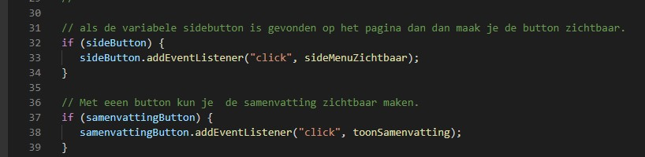

# Procesverslag
Markdown is een simpele manier om HTML te schrijven.  
Markdown cheat cheet: [Hulp bij het schrijven van Markdown](https://github.com/adam-p/markdown-here/wiki/Markdown-Cheatsheet).

Nb. De standaardstructuur en de spartaanse opmaak van de README.md zijn helemaal prima. Het gaat om de inhoud van je procesverslag. Besteedt de tijd voor pracht en praal aan je website.

Nb. Door *open* toe te voegen aan een *details* element kun je deze standaard open zetten. Fijn om dat steeds voor de relevante stuk(ken) te doen.

## Jij

uitwerken voor kick-off werkgroep

### Auteur:
Keisha Alexander

#### Je startniveau:
 Rode piste

#### Je focus:
surface plane
Onderwerpen: Dark/light mode, animaties (loading ect), states van websites, lettergrootte kunnen instellen, svg icon stylen en animeren,
 

## Je website

uitwerken voor kick-off werkgroep

### Je opdracht:
[Website heet Wattpad en de link:] (https://www.wattpad.com/home)
Wattpad is een online bibliotheek waar verschillende mensen fan ficties kan lezen en schrijven. Het is ook een hulpmiddel voor schrijvers die hun vaardigheid wil verbeteren.

#### Screenshot(s) van de eerste pagina (small screen): 
Je bibliotheek 
In je bibliotheek pagina kan je jouw favoriete boeken opslagen. Je kan ze archiveren en ook downloaden om offline te lezen. Het pagina bestaat uit de kaft van de boek en de boektitel. Ook krijg een melding dat het boek een nieuwe hoofdstuk. Verder kun je boeken groeperen.
 

#### Screenshot(s) van de tweede pagina (small screen):
Detailpagina van een boek 
Als je een boek kiest krijg je uitgebreide details van het boek. Zoals samenvatting, auteur van het boek,titel van het boek en andere suggesties ect. De screenshots van de tweede pagina bestaat uit 3 delen. 

##### Deel 1: Algemene informatie van het boek:

##### Deel 2: Samenvatting van het boek:

##### Deel 3: Inhoudsopgave van het boek:

 

## Breakdownschets (week 1)
Deze week heb ik enkele breakdownschets gemaakt die 
noodzakelijk zijn voor maken van het HTML pagina. 

Uitwerken na afloop 2e werkgroep

### De hele pagina: 
#### Versie 1:
Hier is mijn eerste versie van het breakdownschets. 

##### Overzichtpagina van Wattpad.

Het overzichtpagina  die ik wil nameken  is het bibliotheek pagina, waar gebruikers hun boeken kan opslagen  en terugvinden. 
Deze pagina bevat uit een navigatie menus, met afbeeldingen die alllemaal links zijn. 

##### Detailpagina van Wattpad.

De andere pagina bevat alle detail van het boek  die veel secties bevatten. 

### dynamisch deel (bijv menu): 

## Voortgang 1 (week 2)

uitwerken voor 1e voortgang

### Stand van zaken
In het algemeen kan ik zeggen dat, ik de twee pagina had gedaan in een mobiele versie. Maar het is echt een simpele namaak van mijn 
gekozen website. Ik denk dat  er meer  details toegevoegd kan worden. Bijvoorbeeld animatie. Ik wilde ook iconen erbij zetten, maar ik ben bang dat ik de opmaak gaat verpesten. 

Er was een moment waar ik opnieuw begon want ik wilde het een beetje responsive maken. 
Hier zijn de screenshot van de voortgang van de paginas.

#### Pagina 1:

#### Pagina 2:

### Wat goed ging.
- Ik heb de html  twee pagina's. Die een beetje met CSS is vormgegeven. 
- Ik kon de pagina voor mobiel maken, ik moest even spelen met flex box 
- Er wordt een paar theorie in mijn website toegepast zoals het positioneren van elementen. 
- Ik heb goed gebruikt gemaakt van de huisstijl van de echte website.
- Ik lipe niet elke keer vast. 
- De opdrachten waren echt nuttig voor het maken van mijn website. 

### Wat  minder goed ging.
- Ik wilde iconen bijzetten, maar het werd extra moeilijk voor mij om het die te stijlen, maar ik ga op sommige onderdelen wel iconen plaatsen. 
- Ik vind het een beetje simpel, maar ik weet niet of ik iets beter kan. 

### Agenda voor meeting
samen met je groepje opstellen
Mijn Punt 
- Wat jan ik nog toevoegen in mijn paginas.
- Een beetje feedback op mij twee paginas.

| student 1      | student 2          | student 3    | student 4        |
|                | ---                | ---          | ---              |
|                | en dit             | en ik dit    | en dan ik dat    |
| en dat ook nog | dit als er tijd is | nog een punt | dit wil ik zeker |
| ...            | ...                | ...          | ...              |

### Verslag van meeting
hier na afloop snel de uitkomsten van de meeting vastleggen

- Veel commentaar plaatsen in mijn code
- Naam geven bij de commits, zoals je weet wat er verandert is wanneer je file in github upload
- Met javascript de samenvatting korter maken via een button.
- Meer spelen met de surface laag 
- Code een beetje opmaken want het is een beetje slordig, CSS is gewoon spagetti geworden.
- Lange css selectors kunnen onder elkaar zijn, zodat het overzichtelijk wordt.
- Gebruik ook een type unit. Verstandig em te gebruiken in plaats van de pixels. Vooral als je website  responsive ga maken

## Voortgang 2 (week 3)

uitwerken voor 2e voortgang

## Stand van zaken
### Wat goed ging.
- Ik heb javascript toegevoegd aan mijn website. Ik heb een side menu gemaakt die zichtbaar wordt als je op de boekenkaft klikt. Deze code vind je in het bibliotheek. Op  de andere pagina kun je javascript, kun je de samenvatting van het boek tonen en weghalen.

- Ik heb een beetje animatie toegevoegd bij de side menu en ook de bij de bibliotheek titel. 

- Ik heb de footer vormgegeven  met flex-box.

- Ik moet nog de kleine details toevoegen bij de pagina's.

 ### Wat niet goed ging 
 
 - Ik had een beetje moeite met  javascript voor twee HTML pagina's. IK had codes voor elk paginas. Maar het is gelukt door een conditie toe te voegen in die javascript.

 - Ik vind vormgeving een beetje chaotisch en te veel kleurlijk. Ik wil het een beetje minimalistisch maken.
 - Ik weet nog niet waar precies een animatie geschikt is. Tot nu toe is de animatie bij de sidemenu en ook de h1

 ### Mijn punten:
 - Feedback over het lay-out.
 - Helpen met de suggesties boeken, tips krijgen. 
 - Waar kan ik animatie toevoegen ?

### Agenda voor meeting
samen met je groepje opstellen

| student 1      | student 2          | student 3    | student 4        |
| ---            | ---                | ---          | ---              |
| dit bespreken  | en dit             | en ik dit    | en dan ik dat    |
| en dat ook nog | dit als er tijd is | nog een punt | dit wil ik zeker |
| ...            | ...                | ...          | ...              |

### Verslag van meeting
hier na afloop snel de uitkomsten van de meeting vastleggen

- de side menu is voor het boek, maar kan meer op de boek komen. Hierbij kan ik animatie toevoegen.
 - Ik kan het menu vanuit het boek laten komen dan kan je de connectie tussen de boek.
 - De plus icoon omzetten in een vinkje 
 - Ik moet de boek suggesties afmaken.
 - Doe de states opdracht voor volgende week.
 - Meer spelen met de surface laag.
 - Een progressbar toevoegen onder de boeken. Het laat zien hoe ver je bent met het boek. 

## Toegankelijkheidstest (week 4)

uitwerken na test in 8e voortgang

### Bevindingen
### Leven met een screenreader

Voor het toegankelijkheid test had ik een paar tools gebruikt om de leven van mensen met een beperking te kunnen in te leven. 
Daaruit had ik aantal bevinding uitgehaald.
1. De screenreader spraak twee talen, engels en Nederlands. Mijn screenreader is in het engels en op het HTML pagina is de html is in het Nederlands.
2. Het screen reader noemt de aantal links en heading. Maar op het website valt het mee. 
3. Als loopt trager dan ik gewend bent met een screenreader. Ik moest wachten totdat de screenreader alles voorleesde. Maar je kan dingen overslaan.
4. Screen reader op een telefoon is verschrikkelijk, elke keer moet twee drukken om iets te kiezen en het hele ervaring ging heel traag.
5. Elk link wordt voorgelezen met de desbetreffende omschrijving. 
6. Veel dingen wordt in snelle tempo gelezen. Er zijn  veel dingen die achter elkaar wordt gelezen. 
7. Bij een image lees de screenreader de alternatieve tekst van het afbeelding.
8. De screenreader lees de naam van het HTML document voor.

### Screenreader op telefoon
1. Je moet hard drukken om de elementen te activeren.
2. Als je begrijpt hoe de screen reader werkt dan is het makkelijk om te ermee te werken.

### Muis en een toetsenbord 
1. De focus state is een heel belangrijke element voor mensen die een toetsenbord gebruikt.
2. Hover state is niet belangrijk als je een toetsenbordt gebruikt maar wel een muis.
3. Als je de tab toets gebruikt, dan moet je zorgen dat de structuur  logisch is.

### Gele gekleurd bril
1. De achtergrond kleur van het formulier was een lichte groen, maar door die gekleurde bril is die helemaal onzichtbaar geworden.
2. Er was genoeg contrast tussen de tekst en de achtegrond. 

### Wazig bril
1.  Alle tekst waren helemaal niet te lezen. 
2. Ik zag wel contrast tussen de achtergrond en de tekst.
3. De afbeelding waren niet scherp.

#### De tekst waren niet te lezen
Ik droeg de blurry bril. Deze bril kreeg ik een gevoel hoe mensen die slechtziend zijn die niet opgelost kan zijn door een bril te dragen.  Alles was heel wazig. Zonder mijn bril kan dingen die ver weg zijn niet scherp meer zien. 

Toen ik die bril draagt kon ik niks meer zien. De letters waren niet meer te lezen. De tekst was standaard 1em. Maar met die bril waren ze niet eens leesbaar. 

Oplossing 1:
Als een oplossing kan de gebruiker een screen reader gebruiken om de content  te horen. Dus alle links moet goed beschreven worden. Alle afbeeldingen moeten een goede alternatieve tekst bevatten. 

Oplsossing 2:
Andere oplossing is om alle tekst groter te maken. Op mijn website kan het samenvatting van het boek groter zijn met  een grote regelafstand.

#### Toetsenboard gebruikers 
Er zijn ook mensen die geen muis kan gebruiken. 

Oplossing 1:
 In mijn website heb ik de states vooral de focus state duidelijk vormgegeven als je de tab toets gebruikt. 
 In mij geval heb ik de de outline van alle elementen dikker gemaakt. 

Oplossing 2:
Toestcombinaties zou ook handig zijn  om de  website te gebruiken. Bijvoorbeeld een toets combinatie om de detail van het boek te zien.

Oplossing 3: 
Een voice  ai waar de gebruikers commando geven aan de website. Bijvoorbeeld "wattpad open -titel van het boek-" Met dat commando wordt de gekozen boek geopend.            

#### Kleurenblindheid

Sommige mensen zijn niet in staat om alle kleuren evne goed te zien. Dus voor hen is kleuren anders. Bijvoorbeeld voor sommigen kunnen niet ee onderscheid maken tussen  rood en groen. 
Als oefening  droeg ik een geel gekleurde bril. Ik zag alleen maar geel. Op mijn website waren genoeg contrast tussen de achtegrond en de tekst en plaatjes. Maar het geld niet voor alle elementen op het website. 
als je iets op het input veld drukt of hover verandert de achtegrondkleur van de invoer veld van wit naar licht groen. Dus je trigger een active state.  Met het gele bril was de groen niet meer te zien. Dus als oplossing kan ik bij de focus state  de border van de invoer velden dikker maken  dan weet de gebruiker precies bij welk invoerveld hij is. 

#### Concentratie problemen 

Een andere oefening die ik heb gedaan is de web gebruiken terwijl ik de balon niet laat vallen. Ik kan niet eens scrollen zonder dat de balon valt. 

Oplossing 1: 
Dus na een aantal seconde van inactiviteit een stem zou de gebruiker aandacht trekken met een bericht. Bijvoorbeeld: "Keisha je was bezig met het lezen van een samenvatting". 
Ik weet het niet of dit mogelijk is maar het is iets.  

Oplossing 2:
Meer afbeelding of andere grafische elementen gebruiken die de tekst ondersteunen. 

## Voortgang 3 (week 4)

uitwerken voor 3e voortgang

### Stand van zaken
Ik ben klaar met mijn website. Ik moet nog de kleine details zetten. Zoals commentaar. De bronnen vermelden. Voor het laatst heb ik aan het docent gevraagd voor feedback. Ik vroeg wat ik nog meer kan toevoegen bij een van de twee pagina's.
- Meer Animaties
- Een uitgebreide formulier en die stijlen
- De responsiveness verbeteren met media query.

### Agenda voor meeting
samen met je groepje opstellen

| student 1      | student 2          | student 3    | student 4        |
| ---            | ---                | ---          | ---              |
| dit bespreken  | en dit             | en ik dit    | en dan ik dat    |
| en dat ook nog | dit als er tijd is | nog een punt | dit wil ik zeker |
| ...            | ...                | ...          | ...              |

### Verslag van meeting
hier na afloop snel de uitkomsten van de meeting vastleggen

- Code een beetje verzorgd maken. Ik heb allee onnodige codes weggehaald en ook meer commentaar toegevoegd. 
- Bij de javascript  moet ik alle variabele, functions, en eventlisteners  bij elkaar zetten.
- De gebruikers foto's beter positioneren, zodat het niet op het titel blijft.
- Rekening houden met toegankelijkheid.
- Px omzetten in em.
- States toevoegen bij de side menu.

## Eindgesprek (week 5)

uitwerken voor eindgesprek

### Stand van zaken

#### Wat goed ging 
Ik ben klaar met het opdracht voor front-end-development. Ik heb veel geleerd de laatste weken.  Wat ik echt nuttig vond waren de animaties met css maken en positioneren. Ik heb uiteindelijk de wepaginas responsive gemaakt. Het was al een beetje responsive met flexbox maar ik heb met  media query gebruikt om de elementen te verbeteren. Verder is mijn HTML, CSS en Javascript code verzorgd met heel veel commentaar en hier en daar wat bronvermelding. Ik heb de site geopend op mijn telefoon en het werkt.

- Ik heb animatie toegevoegd bij het profiel foto
- Ik heb de active, hover en focus state vormgegeven 
- Ik heb een formulier gemaakt in het bibliotheek pagina 
- 

#### Wat niet  goed ging 
Ik wilde mijn website in dark mode maken door middel media query te gebruiken maar ik had de tijd niet. En mijn custom css property is niet helemaal compleet dus ik heb zo laat staan. Verder wilde ik ook een toggle button maken om de dark mode uit te zetten. Maar ik had ook niet genoeg tijd.
hier screenshot(s) van je eindresultaat
### Screenshot(s)
#### Je bibliotheek pagina 
#### Versie 1 

#### EindVersie 

#### Detail van het boek pagina 
#### Versie 1 

#### EindVersie 

#### Je bibliotheek pagina desktop versie 

#### Detail van het boek pagina desktop versie

#### HTML  

#### CSS 

#### Javascript

## Bronnenlijst

continu bijhouden terwijl je werkt

Nb. Wees specifiek ('css-tricks' als bron is bijv. niet specifiek genoeg).

1. A complete guide to flexbox - https://css-tricks.com/snippets/css/a-guide-to-flexbox/
2. Huisstijl van Wattpad - https://company.wattpad.com/brand-guidelines
3. Background-images properties -https://developer.mozilla.org/en-US/docs/Web/CSS/background-image
4. How to create a responsive header - https://www.w3schools.com/howto/howto_css_responsive_header.asp
5. How to change tabs on Hover - https://www.w3schools.com/howto/howto_js_hover_tabs.asp
6. Calc() - https://developer.mozilla.org/en-US/docs/Web/CSS/calc()
7. Adress element -  https://stackoverflow.com/questions/7290504/which-html5-tag-should-i-use-to-mark-up-an-author-s-name
8.  Iconen website : https://css.gg/
9. Pixels omzetten in em - https://www.w3schools.com/tags/ref_pxtoemconversion.asp
10. Lettertype Barlow - https://fonts.google.com/specimen/Barlow

Iconen:
1. Pijlen rechts - https://css.gg/arrow-right
2. Ogen - https://css.gg/eye
3. Hart -  https://css.gg/heart
4. Lijst -  https://css.gg/layout-list
5. Klok - https://css.gg/time 
6. Medaille -  https://css.gg/trophy
7. Plus - https://css.gg/math-plus
8. Vlag - https://css.gg/flag-alt
9. readme - https://css.gg/readme

Afbeelding boekenkaft uit wattpad in bibliotheek pagina:
1. The rebirth of an ill-fated consort - https://img.wattpad.com/cover/156454935-512-k537006.jpg
2. The contract - https://img.wattpad.com/cover/171288871-512-k852710.jpg
3. Her sister's Fiance - https://img.wattpad.com/cover/80735354-512-k933380.jpg
4. Kingly Desire -  https://img.wattpad.com/cover/149793898-512-k92662.jpg
5. The unfavorite concubine - https://img.wattpad.com/cover/126395472-256-k762502.jpg

Afbeelding boekenkaft uit wattpad in details van het boek pagina:
1. The Play - https://img.wattpad.com/cover/195529118-256-k504456.jpg
2. The Tudor Witch - https://img.wattpad.com/cover/4418363-256-k979864.jpg
3. Cannibalistic - https://img.wattpad.com/cover/164517588-256-k161004.jpg 

